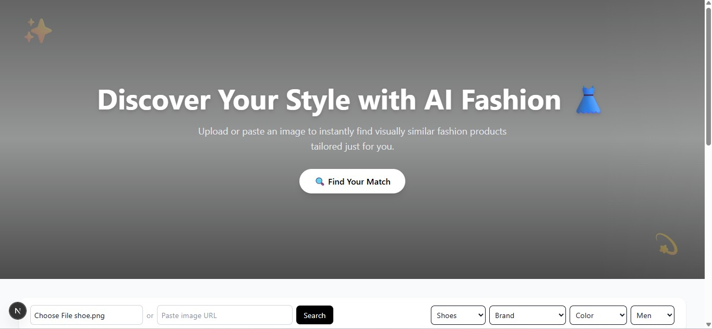
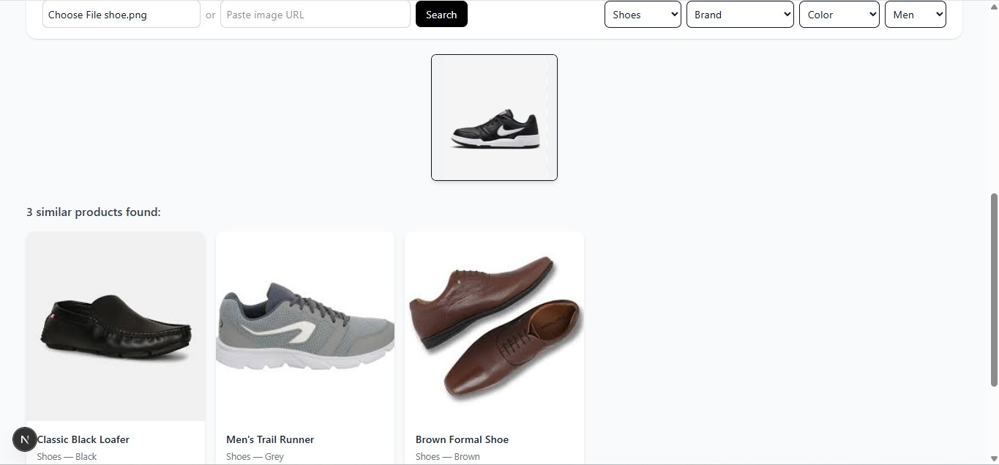

# README 
#  Visual Product Matcher

**Visual Product Matcher** is an AI-powered fashion recommendation web application that helps users find visually similar clothing items using **image-based search**.  
Built with a **Flask + MongoDB backend** and a **Next.js + Tailwind frontend**, the system uses **MobileNetV2** to extract image embeddings and match them against a product database.  

Users can upload an image or paste a URL to find similar items filtered by **brand, color, gender, and category** — offering a seamless, intelligent shopping experience.

---

## 🌐 Frontend Preview

### 🖼️ Home Page  


### 🔍 Search Page  


---

##  Tech Stack

- **Frontend:** Next.js 15, React 19, Tailwind CSS  
- **Backend:** Flask, TensorFlow (MobileNetV2), MongoDB Atlas  
- **AI Model:** MobileNetV2 (Feature Embedding Extraction)  


---

##  Project Structure

VisualProductMatcher/
│
├── backend/
│   ├── app.py
│   ├── config.py
│   ├── insert_products.py
│   ├── requirements.txt
│   ├── test_mongo.py
│   ├── model/
│   ├── utils/
│   └── venv/
│
├── frontend/
│   ├── .next/
│   ├── app/
│   ├── components/
│   ├── node_modules/
│   ├── public/
│   ├── utils/
│   ├── .env.local
│   ├── .gitignore
│   ├── eslint.config.mjs
│   ├── jsconfig.json
│   ├── next.config.mjs
│   ├── package.json
│   ├── package-lock.json
│   ├── postcss.config.mjs
│   └── README.md
│
├── images/
│
├── .gitignore          
└── README.md          


---

##  Setup Instructions

###  Backend (Flask)
```bash
cd backend
pip install -r requirements.txt
python app.py


### Frontend(next.js)
```bash
cd frontend
npm install
npm run dev

----

## Link
Flask API runs on http://127.0.0.1:5000

Frontend runs on http://localhost:3000

## Author

 Sneha Ghosh

© 2025 Visual Product Matcher — All Rights Reserved.
